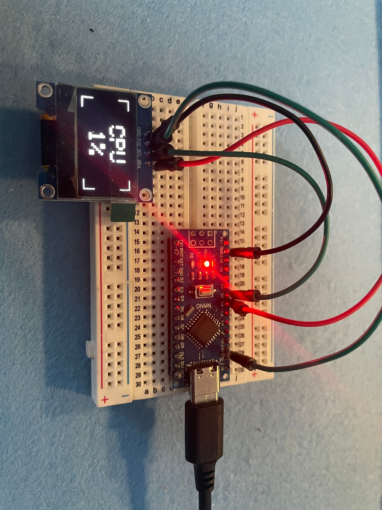
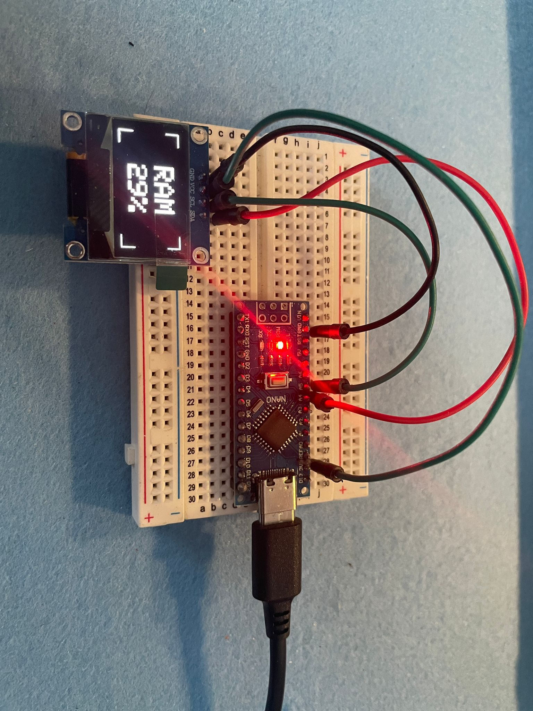
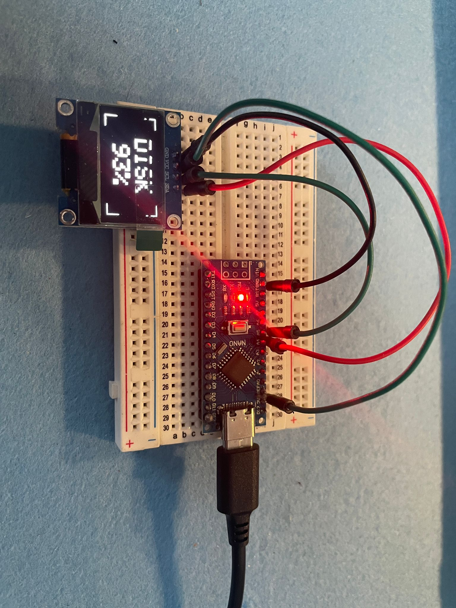
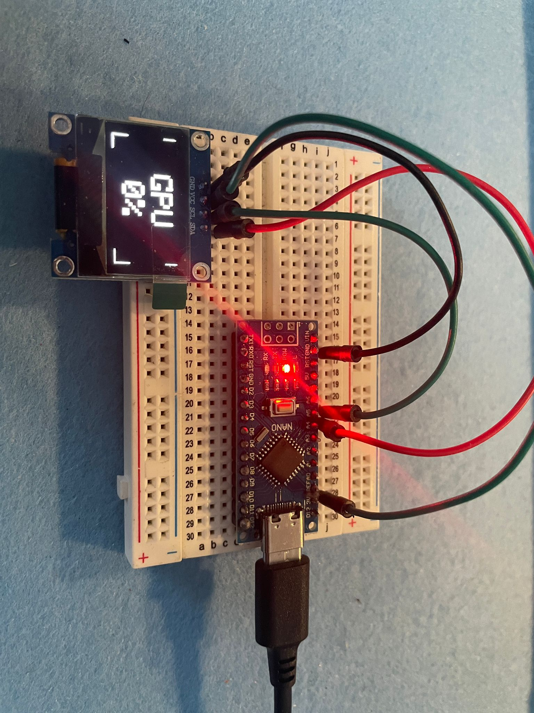

# Pugliese Hardware — System Monitor

Dashboard hardware per PC che mostra **CPU / GPU / RAM / DISK** su display OLED 128×64, con slider automatico ogni 6 secondi e spegnimento automatico del display quando il PC viene spento o disconnesso.

<<<<<<< Updated upstream
Realizzato da **Pugliese Hardware** 
=======
Realizzato da **Pugliese Hardware** — [pugliese-hardware.it](https://pugliese-hardware.it)

## 📸 Screenshot Test






---
>>>>>>> Stashed changes

## Specifiche tecniche

| Componente | Dettaglio |
|---|---|
| Microcontrollore | ATmega328PB (16 MHz) |
| Display | OLED SSD1306 128×64 px, I2C |
| Alimentazione | 5V dalla porta seriale (USB del PC) |
| Baud rate | 115200 |
| FPS | ~50 (animazione fluida) |
| Dimensioni firmware | 182 righe, ~4 KB flash |

## Layout display

```
  ┌─────          ─────┐
  │                    │
  │       CPU          │ ← nome metrica (size 3)
  │       45%          │ ← percentuale (size 3)
  │                    │
  └─────          ─────┘   ← angolari cyberpunk
```

- **Slide automatica** ogni 6 secondi: CPU → GPU → RAM → DISK
- **Transizione fluida** con smoothing esponenziale
- **Angolari HUD** stile cyberpunk
- **Caratteri grandi** (text size 3) per leggibilità fino a 15 metri
- **Logo aziendale** bianco su nero all'avvio (2.5 secondi)

## Spegnimento automatico display

- Display **ON** quando il PC invia dati sulla seriale
- Display **OFF** (sleep 0.9 mA) dopo 3 secondi senza dati
- Si riaccende automaticamente alla prima ricezione

## Cablaggio

| OLED | ATmega328PB |
|---|---|
| VCC | 5V |
| GND | GND |
| SDA | A4 |
| SCL | A5 |

## Installazione automatica (consigliata)

Il modo più semplice per far funzionare il prodotto: collega l'hardware via USB ed esegui il setup.

### Metodo 1 — Setup.exe

Esegui `Output\MonitorSystem_PuglieseHW_Setup.exe` → il setup installa Python (se mancante), le librerie necessarie e configura l'avvio automatico all'accesso di Windows.

### Metodo 2 — Manuale (per utenti esperti)

Vedi sezione "Software PC" qui sotto.

## Installazione firmware

### 1. Librerie necessarie

Apri l'Arduino IDE → **Strumenti → Gestione librerie** e installa:

- **Adafruit SSD1306** by Adafruit
- **Adafruit GFX** by Adafruit

### 2. Carica lo sketch

1. Apri `firmware/system_monitor/system_monitor.ino`
2. Seleziona la scheda **ATmega328PB** (o Arduino Uno / Nano)
3. Collega l'hardware via USB
4. **Carica** (Upload)

Non servono librerie aggiuntive — il firmware è un singolo file autocontenuto.

## Avvio automatico all'accensione del PC

### PowerShell — Attività schedulata (consigliata)

Apri **PowerShell come amministratore** ed esegui:

```powershell
# Crea attività che parte al login (nascosta, senza finestra)
$action = New-ScheduledTaskAction -Execute "powershell.exe" -Argument "-WindowStyle Hidden -File `"$env:USERPROFILE\system-monitor\scripts\send_stats.ps1`""
$trigger = New-ScheduledTaskTrigger -AtLogOn
Register-ScheduledTask -TaskName "PuglieseHW System Monitor" -Action $action -Trigger $trigger -RunLevel Limited -Force
```

Per rimuoverla:
```powershell
Unregister-ScheduledTask -TaskName "PuglieseHW System Monitor" -Confirm:$false
```

### PowerShell — Cartella Avvio (alternativa semplice)

1. Premi `Win + R`, scrivi `shell:startup`, premi Invio
2. Crea un collegamento a `send_stats.ps1` nella cartella che si apre
3. (Opzionale) Per nascondere la finestra, cambia il target in:
   ```
   powershell.exe -WindowStyle Hidden -File "C:\percorso\completo\send_stats.ps1"
   ```

### Python — Attività schedulata

```powershell
$python = (Get-Command python.exe).Source
$action = New-ScheduledTaskAction -Execute $python -Argument "`"$env:USERPROFILE\system-monitor\scripts\send_stats.py`""
$trigger = New-ScheduledTaskTrigger -AtLogOn
Register-ScheduledTask -TaskName "PuglieseHW System Monitor" -Action $action -Trigger $trigger -RunLevel Limited -Force
```

Se `python.exe` non è nel PATH, specifica il percorso completo:
```powershell
$python = "C:\Python312\python.exe"
```

## Software PC — Invio statistiche

### Script PowerShell (nativo Windows, nessuna installazione)

```powershell
# Auto-detect porta Arduino
.\scripts\send_stats.ps1

# Porta specifica
.\scripts\send_stats.ps1 -Port COM3 -Interval 500
```

### Script Python (con psutil + pyserial)

```bash
pip install psutil pyserial

# Auto-detect porta Arduino
python scripts\send_stats.py

# Porta specifica
python scripts\send_stats.py --port COM5 --interval 1000
```

Entrambi gli script inviano in tempo reale:
- **CPU**: lettura diretta via WMI (PowerShell) / psutil (Python) con smoothing 0.3
- **GPU**: lettura NVIDIA via nvidia-smi, fallback AMD, stima generica
- **RAM**: percentuale utilizzata
- **DISK**: percentuale occupata del disco C:

## Formato dati seriali

```
CPU:76.5|GPU:52.3|RAM:81.2|DISK:43.1\n
```

I valori sono float nel range 0–100, separati da pipe (`|`), terminati da newline (`\n`).

## Debug

| Problema | Soluzione |
|---|---|
| OLED nero | Verifica cablaggio I2C (SDA→A4, SCL→A5, VCC→5V, GND→GND) |
| OLED nero | Controlla indirizzo I2C (default 0x3C, alternativo 0x3D) |
| Nessun dato | Apri Monitor Seriale a 115200 per verificare la ricezione |
| % non visibile | Nessun problema — il firmware adatta la formattazione automaticamente |

## Struttura del repository

```
system-monitor/
├── firmware/
│   └── system_monitor/
│       └── system_monitor.ino    ← firmware principale (unico file)
├── scripts/
│   ├── send_stats.ps1            ← script PowerShell per Windows
│   └── send_stats.py             ← script Python (psutil)
├── Logo.pdf                      ← logo aziendale per silkscreen PCB
└── README.md                     ← questo file
```

## Cronologia versioni

**v1.0** — Release iniziale
- Logo avvio 2.5 s
- Slider CPU/GPU/RAM/DISK 6 s
- Display OFF a 3 s di timeout
- Design cyberpunk con angolari HUD
- Compatibile con Arduino IDE + Adafruit SSD1306/GFX

---

*Pugliese Hardware © 2026 — Tutti i diritti riservati*
